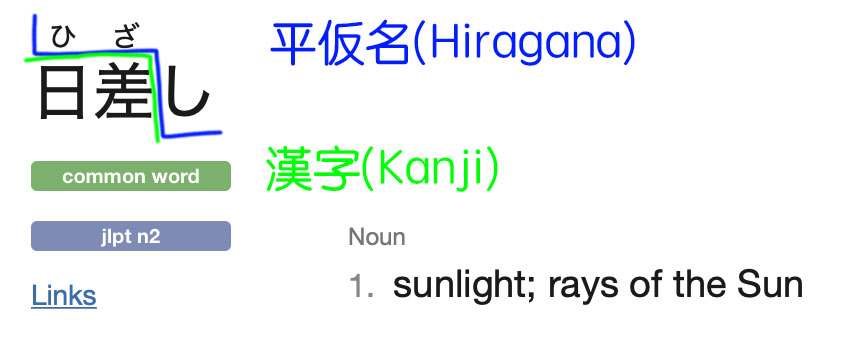

| Japanese | English  | Example     |
|----------|----------|-------------|
| 漢字     | Kanji    | 日差        |
| 仮名     | Kana     |  |
| 平仮名   | Hiragana | ひざ    |
| 片仮名   | katakana |             |