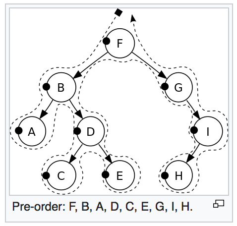
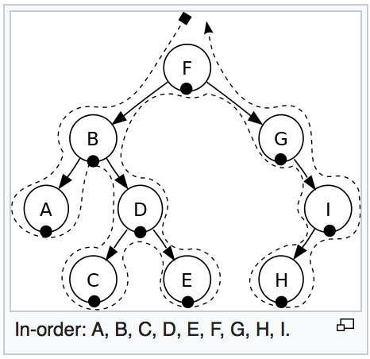
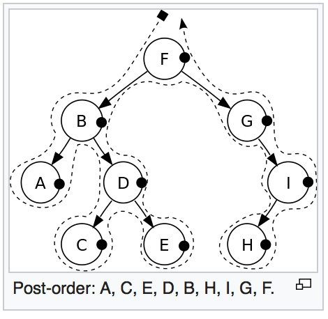

惭愧，刷题的时候发现这个都已经生疏了，在此写出来熟悉熟悉。

节点定义：

```python
class TreeNode:
    def __init__(self, x):
        self.val = x
        self.left = None
        self.right = None
```

# 前中后序遍历 递归写法

递归的写法很简单，不同种类的遍历代码的顺序略微不同。

```python
class Solution(object):
    def inorder(self, root, path):
        if root is None:
            return
    
        # preorder path.append(root.val)
        self.inorder(root.left, path)
        # inorder path.append(root.val)
        self.inorder(root.right, path)
        # postorder path.append(root.val)
    
    def inorderTraversal(self, root):
        """
        :type root: TreeNode
        :rtype: List[int]
        """
        ans = []
        self.inorder(root, ans)
        return ans
```

# 前序遍历 preorder
遍历顺序：访问当前节点，接着访问左右节点。



```python
class Solution:
    def preorderTraversal(self, root):
        """
        :type root: TreeNode
        :rtype: List[int]
        """
        if root is None:
            return []

        ans = []
        stack = [root]

        while len(stack) != 0:
            head = stack.pop()

            ans.append(head.val)

            if head.right is not None:
                stack.append(head.right)

            if head.left is not None:
                stack.append(head.left)

        return ans
```

# 中序遍历 inorder
遍历顺序：访问所有左节点后才访问当前节点，最后是右节点。



```python
class Solution(object):
    def inorderTraversal(self, root):
        """
        :type root: TreeNode
        :rtype: List[int]
        """
        ans = []
        stack = []

        cur = root
        while cur is not None or len(stack) != 0:
            while cur is not None:
                stack.append(cur)
                cur = cur.left
            cur = stack.pop()
            ans.append(cur.val)
            cur = cur.right

        return ans
```

# 后序遍历 postorder
遍历顺序：访问所有左右节点后才访问当前节点。


```python
class Solution(object):
    def postorderTraversal(self, root):
        """
        :type root: TreeNode
        :rtype: List[int]
        """
        if root is None:
            return []
    
        ans = []
        stack = [root]
        revisit = []
    
        while len(stack) != 0:
            head = stack.pop()
            revisit.append(head)
            if head.left:
                stack.append(head.left)
    
            if head.right:
                stack.append(head.right)
    
        while len(revisit) != 0:
            ans.append(revisit.pop().val)
    
        return ans
```

# 层序遍历

这里是把每一层都单独输出到一个数组。在每层最后一个元素之后加上一个标识符（比如这里的 None），以此判断每一层是否读取完。

```python
class Solution(object):
    def levelOrder(self, root):
        """
        :type root: TreeNode
        :rtype: List[List[int]]
        """
        if not root:
            return []
        ans = []
        queue = [root, None]

        curLevel = []

        while len(queue) != 0:
            # all nodes visited
            if not queue[0]:
                break

            head = queue.pop(0)
            end = True if not queue[0] else False

            curLevel.append(head.val)

            if head.left:
                queue.append(head.left)
            if head.right:
                queue.append(head.right)
            if end:
                # pop the None element
                queue.pop(0)
                ans.append(curLevel)
                curLevel = []
                queue.append(None)

        return ans
```