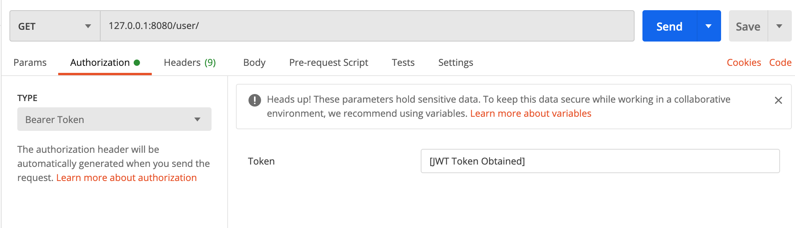

> Summary: I integrated JWT auth to my Django application that uses RESTful and GraphQL
> You can check the repo here: https://github.com/asvrada/home-dashboard-backend

## The Goal / Expected outcome

Goal: To enable user authentication by JWT in your Django application's RESTful API and GraphQL API.

In this article, I assume the two library that implement these 2 type of APIs are:

* [Django REST framework](https://www.django-rest-framework.org/)
* [graphene-django](https://github.com/graphql-python/graphene-django)

For example, there is this Django application that expose two APIs:

```python
# RESTful API
/user/

# GraphQL API
/graphql/
```

And after reading this article, you will be able to build an application where you can query both endpoints with the same JWT token (after fetching the token) like this:



## The Problem

Indeed, each library (REST framework and graphene-django) comes with its own JWT plugin/extension:

* [djangorestframework-simplejwt](https://github.com/SimpleJWT/django-rest-framework-simplejwt)
* [django-graphql-jwt](https://django-graphql-jwt.domake.io/en/latest/)

But these two library don't work with each other out-of-the-box. In other words, JWT token obtained from RESTful JWT endpoint won't work with GraphQL endpoints, and vice versa.

## Solution

I know there might be a way to configure these 2 JWT libraries so that they work with each other. However I take a different approach: customize entire Django application to make it use RESTful JWT library.

Since my Django application is a pure backend server with only RESTful and GraphQL API exposed, enforcing JWT to every endpoint works for my use case.

I will skip the usual Django application creation/setup step since there is plenty of such tutorial.

### backend

The first step is to create a custom Django authentication backend. A Django authentication backend will try to find the correct user given the request, like username and password, however, in this case it will take the JWT in the header and try to authenticate the user.

> How to write custom authentication
> https://docs.djangoproject.com/en/3.0/topics/auth/customizing/#specifying-authentication-backends

```python
# file: backend/backends.py
from rest_framework_simplejwt.authentication import JWTAuthentication


class JWTBackend:
    authenticator = JWTAuthentication()

    def authenticate(self, request=None, **kwargs):
        if request is None:
            return None

        # calls restful jwt auth
        tuple_user = self.authenticator.authenticate(request)

        if type(tuple_user) is tuple:
            return tuple_user[0]

        return None
```

And, add this backend we created to `settings.py`:

```python
AUTHENTICATION_BACKENDS = [
    'backend.backends.JWTBackend',
    'django.contrib.auth.backends.ModelBackend',
]
```

If the JWT token is valid, this method will return a Django's `User` object of the authenticated user.


### middleware

Now we have the backend that will take a JWT and process it to authenticate user, but we are not calling it yet. We can invoke it by adding a step to the middleware of our Django application.

```python
# file: backend/middleware.py
import logging

from django.contrib.auth import authenticate


class JWTAuthMiddleware:
    def __init__(self, get_response):
        self.get_response = get_response
        # One-time configuration and initialization.

    def __call__(self, request):
        # Code to be executed for each request before
        # the view (and later middleware) are called.

        logging.info("JWTAuthMiddleware called")
        # authenticate user
        try:
            user = authenticate(request)
            if user is not None and user.is_authenticated:
                logging.info("JWTAuthMiddleware user set " + str(user))
                request.user = user
        except Exception as err:
            logging.info("JWTAuthMiddleware failed " + str(err))

        response = self.get_response(request)

        # Code to be executed for each request/response after
        # the view is called.

        return response

```

Note `django.contrib.auth.authenticate` will try each authentication backend in the `settings.py` until one returns a valid `User` object.

Also you could see that this middleware doesn't have much things to do with `JWT`, it just calls the backend to auth the request. 

And, add this middleware to `settings.py`

```python
MIDDLEWARE = [
    ...
    'backend.middleware.JWTAuthMiddleware'
]
```

## Usage

Now everything is ready. However you will have to only use `rest_framework_simplejwt`'s views to interact with JWT token (like obtaining one, verifying one and refreshing one)

Assume you have the following endpoint to obtain a JWT token, you could call this endpoint with username and password, and get token in response. Then you can use this token in your header to call RESTful and GraphQL APIs in your application.

```python
# file: urls.py
from rest_framework_simplejwt.views import TokenObtainPairView

urlpatterns += [
    path('login/', TokenObtainPairView.as_view(), name='login')
]
```

## Recap

We add an authentication backend that tries to validate the JWT in an incoming request, then we add a middleware layer to call this backend to try to authenticate each request.

This JWT authenticate is application-wide since we add it to the MIDDLEWARE setting. You could reduce the scope by individually adding the middleware to RESTful framework's setting and to GraphQL's setting.
