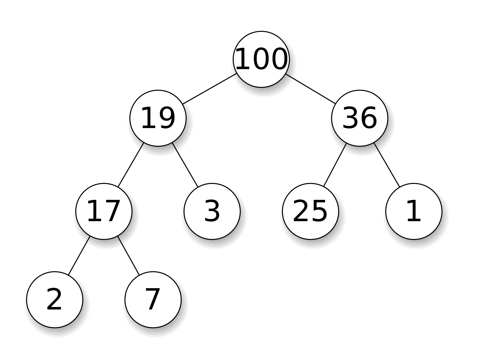
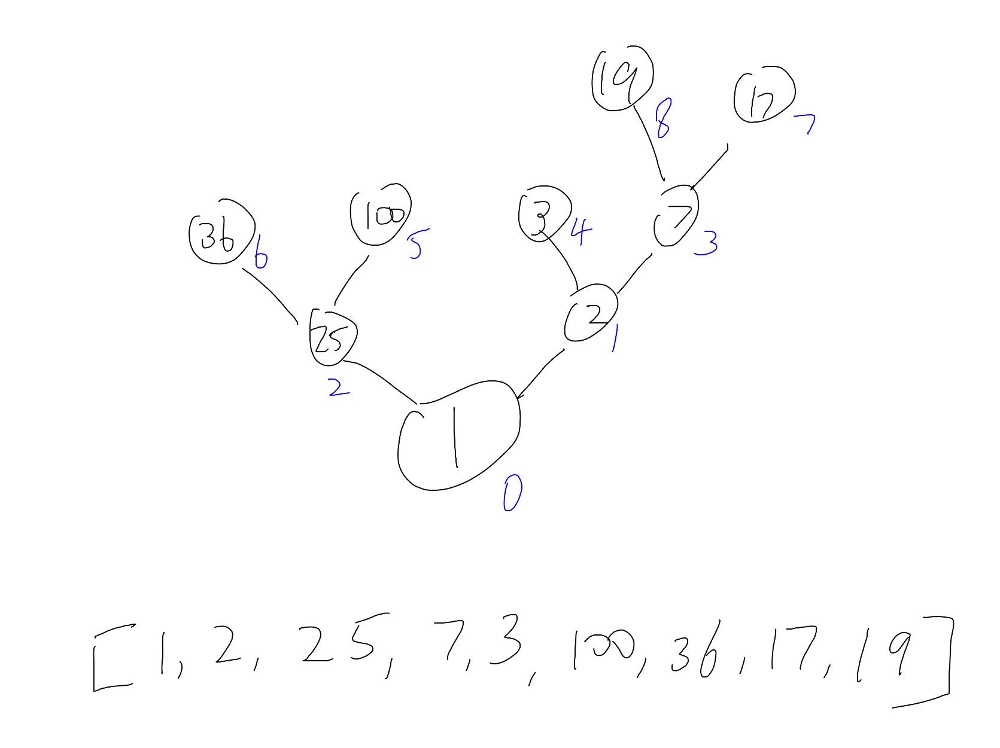

# Introduction
Heap is a tree based data structure, it is commonly used to implement things like priority queue where sort order is important. 

In terms of the implementation of heap, generally we use a complete binary tree represented by a 1D array. This tree representation has following characteristics:

0. The value of node is bigger than both of its children (hence a max heap, vice versa)
1. The left child of node at index `i` is at index `i * 2`
2. The right child of node at index `i` is at index `i * 2 + 1`

_Binary Max Heap and how we store it in an array_


`heap = [100, 19, 36, 17, 3, 25, 1, 2, 7]`

# Operations on heap

There are two common operations on a heap.

Following are codes for a Min Heap, where the parent is smaller than its children. And rather than confuse the future me or readers, I will simply copy & paste the Python's official implementation of Heapq here.

Note when visualize the shift up / down operations, you should imagine a tree where its root is at the bottom, like a real tree, rather than more common one like shown above.


_Blue subscript is the index_

> Below codes from Python's implementation of heap:  
> [https://svn.python.org/projects/python/trunk/Lib/heapq.py](https://svn.python.org/projects/python/trunk/Lib/heapq.py)

## Push

Append the new item to the end of array, then shift it down if its smaller than its parent.

```python
def heappush(heap, item):
    """Push item onto heap, maintaining the heap invariant."""
    heap.append(item)
    _siftdown(heap, 0, len(heap)-1)

# 'heap' is a heap at all indices >= startpos, except possibly for pos.  pos
# is the index of a leaf with a possibly out-of-order value.  Restore the
# heap invariant.
def _siftdown(heap, startpos, pos):
    newitem = heap[pos]
    # Follow the path to the root, moving parents down until finding a place
    # newitem fits.
    while pos > startpos:
        parentpos = (pos - 1) >> 1
        parent = heap[parentpos]
        if newitem < parent:
            heap[pos] = parent
            pos = parentpos
            continue
        break
    heap[pos] = newitem
```
## Pop

Remove the head, and put the last element to the head, then shift it up.

```python
def heappop(heap):
    """Pop the smallest item off the heap, maintaining the heap invariant."""
    lastelt = heap.pop()    # raises appropriate IndexError if heap is empty
    if heap:
        returnitem = heap[0]
        heap[0] = lastelt
        _siftup(heap, 0)
    else:
        returnitem = lastelt
    return returnitem

def _siftup(heap, pos):
    endpos = len(heap)
    startpos = pos
    newitem = heap[pos]
    # Bubble up the smaller child until hitting a leaf.
    childpos = 2*pos + 1    # leftmost child position
    while childpos < endpos:
        # Set childpos to index of smaller child.
        rightpos = childpos + 1
        if rightpos < endpos and not heap[childpos] < heap[rightpos]:
            childpos = rightpos
        # Move the smaller child up.
        heap[pos] = heap[childpos]
        pos = childpos
        childpos = 2*pos + 1
    # The leaf at pos is empty now.  Put newitem there, and bubble it up
    # to its final resting place (by sifting its parents down).
    heap[pos] = newitem
    _siftdown(heap, startpos, pos)
```

## Heapify

Given any arbitrary array, this function turns it into a Heap, again, a min heap in this implementation.

Note `i` moves from middle to 0

```python
def heapify(x):
    """Transform list into a heap, in-place, in O(len(heap)) time."""
    n = len(x)
    # Transform bottom-up.  The largest index there's any point to looking at
    # is the largest with a child index in-range, so must have 2*i + 1 < n,
    # or i < (n-1)/2.  If n is even = 2*j, this is (2*j-1)/2 = j-1/2 so
    # j-1 is the largest, which is n//2 - 1.  If n is odd = 2*j+1, this is
    # (2*j+1-1)/2 = j so j-1 is the largest, and that's again n//2-1.
    for i in reversed(xrange(n//2)):
        _siftup(x, i)
```