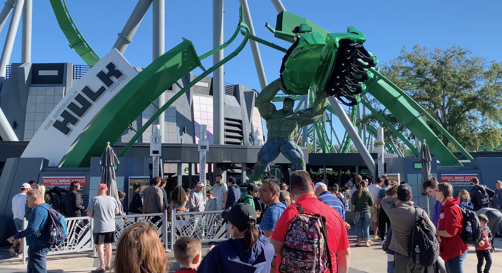
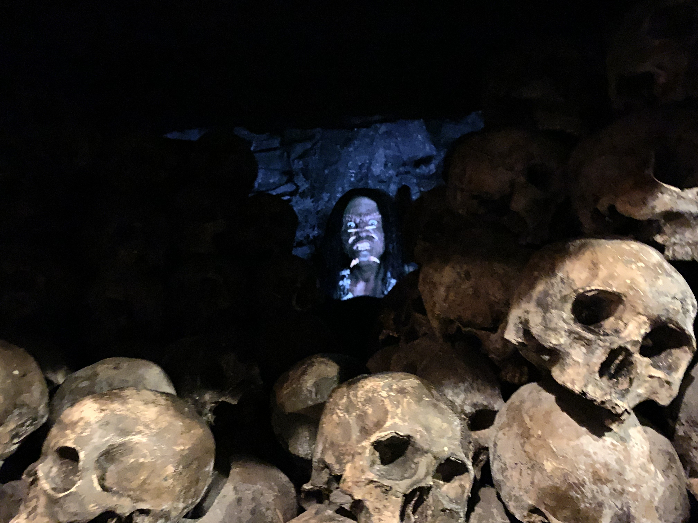
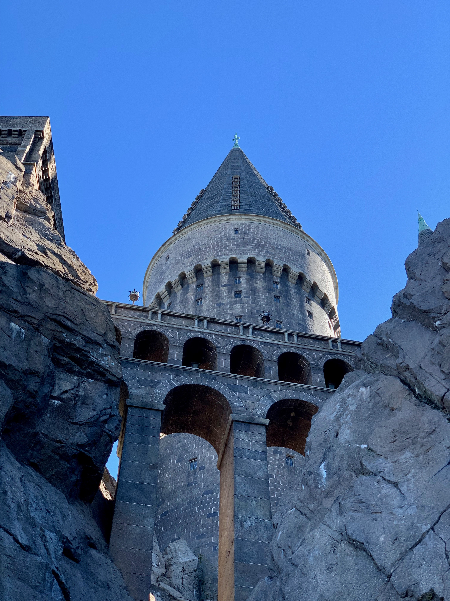
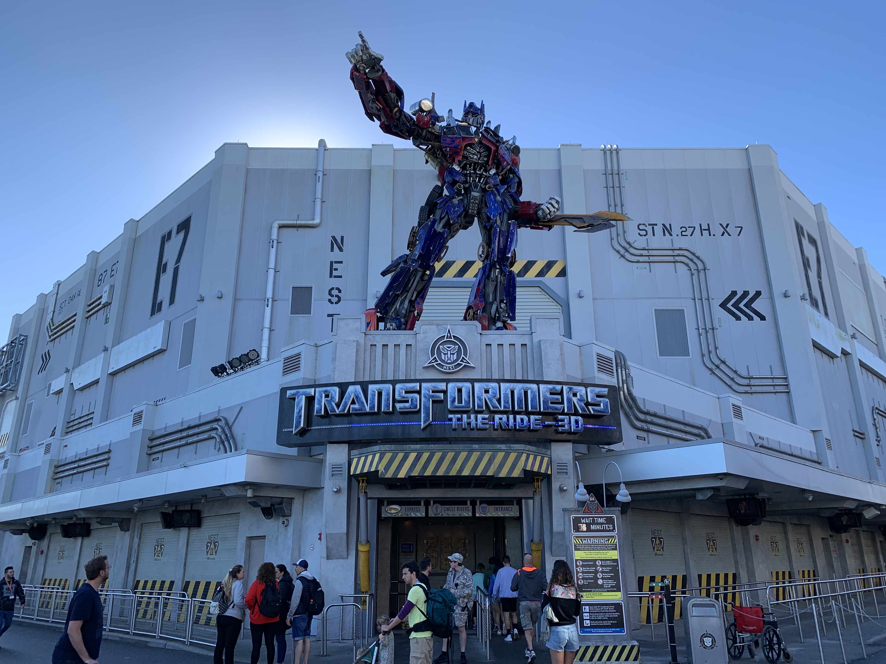
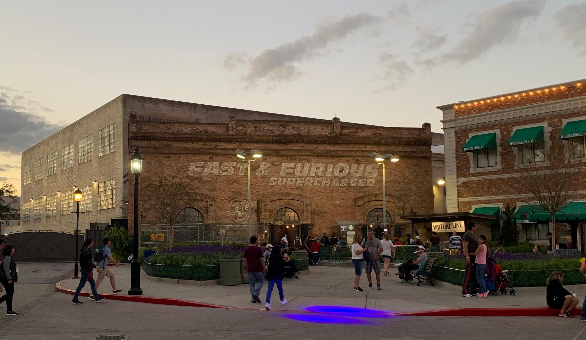
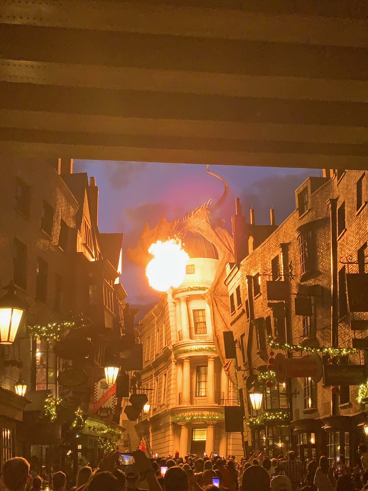

过去两天游玩了佛罗里达环球影城的两个园区：主区 Universial Studios Florida 和冒险岛 Island of Adventrue。即使没买快速票也顺利的玩完了所有大型的过山车项目，在此总结分享一下。

以下按照我的游玩顺序列出。

# 冒险岛 | 第一天

由于是星期天，人比较多，每一个项目几乎都要排一小时左右。蛮长的等待导致对项目的要求也随之升高。。

## 无敌浩克 | 室外过山车

第一个排的项目是无敌浩克主题的那个过山车。由于是第一次来环球影城排的第一个项目，一切都挺新鲜的。特别是排队区域完全根据故事背景而搭建。无敌浩克的话背景是某辐射实验室，不得不说场景搭的还有模有样的。首先整体用材就很讲究，原本该是什么材料就是什么材料做成的，而不是用廉价塑料涂一层金属漆了事。即使是摸上去也很有质感。然后细节也不错，各种实验室的警示标示，数据监视器，警报啥的都像模像样。至于本体过山车嘛。。。就是个普通的室外过山车。除了起步阶段猛的一加速比较刺激，剩下的路程我都能镇定自如的根据眼前的轨道预测冲击方向，并调整坐姿，以最小化刺激程度（？？？）。关于刺激程度，我觉得可以用“屁股离开座位”的程度来描述。通常极速的下坠会导致屁股离开座位（失重），而较长的失重时间通常又意味着接下来高速状态下的各种激烈运动。因此失重感越强，这个过山车通常就越刺激。至于这个过山车，屁股几乎没有离开座位，还行吧。

## 神奇蜘蛛侠 | 4D 过山车

4D 过山车这个东西是环球他们自己起的名字。这种过山车最大的特色便是将过山车放于室内进行，并在轨道周围辅以实体道具+高端视觉效果，比如3D环绕视频加上喷水喷气、座椅倾斜等实体效果，实现逼真的临场感。我是人生中第一次乘坐这种4D过山车，不得不说效果真的挺强的，环球刷新了我对游乐设施科技含量的认知。

当然环球不只是对短暂的游玩过程下了功夫，等待区域也是增添真实感的绝佳区域。比如这个蜘蛛侠，背景是漫画而不是漫威电影，因此整体风格照着蜘蛛侠隐姓埋名工作的报社(The Daily Bugle)装修。而作为预热，各处都放有显示器播放报社社长为游客介绍故事背景：你们这些新招募来的西方记者啊，还是要学习一个、怎么搞一个大新闻，我让你们组队去蜘蛛侠抗击犯罪的前线实地训练一下。个人觉得比较有趣的是，社长一本正经的介绍完后，镜头一掐，他立马转头掏出电话说这群人撑不过去的，赶紧招募下一批人。幽默的解释了为什么游乐设施需要一班又一班的重复这个流程。

回到过山车体验本身，初次游玩确实挺新奇的，虚拟视频结合实际过山车的动作，让整个参与蜘蛛侠打击罪犯第一线的过程非常真实。只不过我们全程都只是坐着围观蜘蛛侠输出顺便吸收反派的火力，毫无还手之力，蜘蛛侠不得不在打击罪犯的同时抽出手carry我们这帮挂机队友。最终忙完了，蜘蛛侠反而还不停“谢谢你们帮了大忙”，感觉挺出戏的。。。

## 金刚 | 4D 过山车

> 睁眼张口男.jpg

同样也是4D过山车，这个的主题是金刚，那个大猩猩，不过不是爬纽约帝国大厦，而是在丛林打击恐龙。。。。

这个的刺激程度比蜘蛛侠小了不少，但是配合视频演出效果依旧惊艳。特别是进入巨型山洞那一段，视频配合体感运动，我过了一会才确定这不是实景而只是视频的效果罢了。

## 哈利波特 球赛 | 4D 过山车

> 游乐设施外围城堡装饰

这个4D过山车与上面几个不同之处在于：它的座位是悬空的，你的脚下没有平台，刺激程度+++

过山车背景是哈利波特电影中那个骑着扫帚捉会飞的小球的球赛，由于我根本没看过哈利波特。。。我就不多说了。

这个项目的质量是这整个园区里最好的，从等待区域对电影场景的高度还原到实际过山车刺激真实的体验，无人能及，好吧，我先吹爆。运行过程中随着哈利上飞下蹿，座位也翻来覆去，再配合电影级（其实没那么好）的视频演出，整体感觉我再次吹爆。

做为一个相信科学，热衷于了解事物背后运行原理的人，在做其他过山车的时候我都会尽力观察这个设施的工作原理。比如神奇蜘蛛侠那个，你是坐在一个沿着地面轨道行驶的小车里，只不过这个小车能够旋转/倾斜，给你营造一种下坠/冲击的错觉。而金刚中，我们乘坐的小车是无轨的，使用类似普通汽车的橡胶轮胎承载。为了营造各种运动感，这个小车会开到一个平台上去，通过这个平台的倾斜，加上包围平台的视频投影，营造各种感觉。至于哈利波特这个，我在游玩过程中趁着喘息之余四处观察，也没有看到任何的轨道/载具，除了把你固定住的座椅，再找不到任何让你出戏的元素，临场感爆炸。

# 主区 | 第二天

## 变形金刚 | 4D 过山车

> 第二天去的比较早，去的时候这个项目都没什么人，不排队就坐上了，爽。

这个过山车嘛，很明显，背景是变形金刚。幸好是电影版变形金刚，总算是个我看过的了，昨天坐的那几个背景我全不了解，不是很爽。

等待区的装修没得说，电影级别。中间还有一个火种碎片的模型，由于没人排队因此没有仔细观察。至于过山车本身，套路都是一样的，有轨小车+3D视频演出。故事是霸天虎来袭，擎天柱让我们带上火种坐车赶紧跑路。当然这个过程少不了我们各种划水，反向carry汽车人，让他们忙成一团。既然背景是电影版变形金刚，那些银幕上熟悉的面孔自然是一个都没少：擎天柱，大黄蜂，红蜘蛛，威震天等等。

其中我要点名红蜘蛛，没想到在这他还在继续上演拿手的脚底抹油逃命绝技：一看到汽车人略占上风，红蜘蛛直接麻溜的变身飞走，留下己方大哥威震天被各种乱干。。。

另外令我惊喜的是，这个过山车不像前几个那样，观众真实全程划水、坐等被carry、坐等正派自己解决反派然后再无耻的接受各种“啊谢谢你帮我这么大的忙”夸赞，最后双方扭打在一起的时候，我们观众也真正的帮上了擎天柱，击败威震天。不过至于发生了什么，自己去看吧 `_(:з」∠)_`。

> 可参考《变形金刚1》结尾，将抱着火源的山姆替换成此处的观众。鸡智的你一定能猜出来的。

## 速度与激情 | 4D 过山车

看来环球的招牌就是这一个个设计精良的4D过山车，这次背景是《速度与激情》中的主角一行人的车库。排队的同时你可以欣赏车库内各个主角的座驾，音响也在轮播电影中经典的音乐，当*Turn Down For What*响起的时候，排队的人群都沸腾了起来，不少人随着音乐唱了出来（我打赌他们都没有看过这首歌的MV）。就排队体验来说，这个项目绝对是最嗨的一个，靓车配上劲爆的音乐总能最快的激起人的肾上腺素。

更令我惊喜的是，这个项目还有“剧情”。游客被邀请进一个房间，屏幕上开始播放预先录制的视频（电影原班人马演出），工作人员则扮演车库管理大妈与之互动，让参与感提升不少。这个过程当然也少不了各种幽默：

*“你们（指游客）只要进了这个车库，我们就是一家人”*

*（突然得知反派要来砸场子)*

*“快找人把这些平民运走”*

*车库大妈：哦。。。我还以为我们是一家人呢。。。*

如此一番真人+视频的互动，给整个流程增色不少。只可惜啊，实际过山车过于平淡无奇。首先游玩过程不需佩戴3D眼镜，因为视频都是2D的。而2D的视频从边缘的座位看去，视角是非常奇怪的。我就不幸坐在最边上，从我这看，视频的透视完全扭曲了，一点立体感也没有。可以想像全程观看小矮人一样的范迪塞尔装B是什么感受。

总之，除了实际过山车部分，这个项目是挺不错的`_(:з」∠)_ `

## 哈利波特 打伏地魔 | 4D 过山车

> 喷火才艺表演

不像昨天的哈利波特项目拥有独特的过山车系统，这次的载具与普通过山车并无大的区别，因此即使加上4D视频，整体体验也是中规中矩。

## 小黄人 + 辛普森一家 | 4D 电影

由于座位固定，并不沿着任何轨道前进，仅仅进行倾斜等运动，因此这玩意都不能算过山车。本人虽然看小黄人电影，但是总觉得小黄人太幼稚，因此对此项目无感。中规中矩。至于辛普森一家，则完全不知道他们在干嘛了，到是这个漫画风格有点像《南方公园》，题材非常成人。

## 某室外过山车

第一个弯就是垂直上升+疾速下降并翻滚一圈的过山车，一看就属于那种怎么刺激怎么来的项目。实际也确实如此，坐完全程后，除了头被抖的难受，并无其他感觉。这种过山车，就是瞎JB抖，纯生理上的刺激，真的没什么意思。不坐浪费钱，坐了也没感觉。差评。

## 木乃伊的复仇 | 4D 过山车

明明作为室内过山车，这个项目的设计师似乎有点放飞自我。室内黑暗环境的加持下，过山车整体的激烈程度不亚于上面那个。。。各种猛烈的转弯，上升下降，我的3D眼镜都快飞出去了。。。

---

作为一个游乐项目，环球影城无疑是非常值得一去的。整体游乐设施非常先进，绝对能带给你其他设施无法匹及的体验。更别说超级热情负责的工作人员了，让你能够以放松的心态享受园区的各种游乐项目。