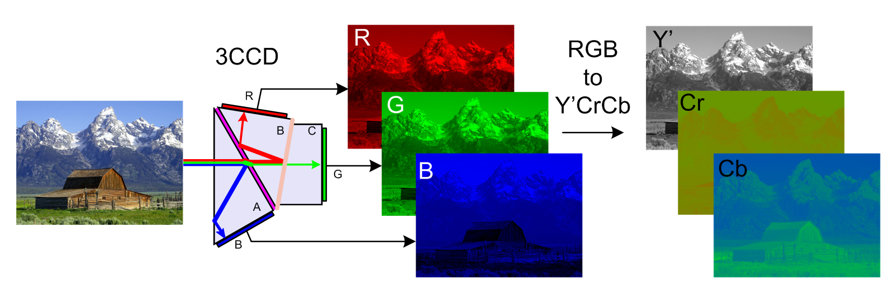
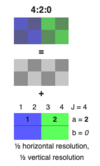
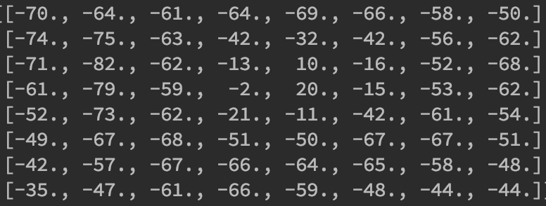
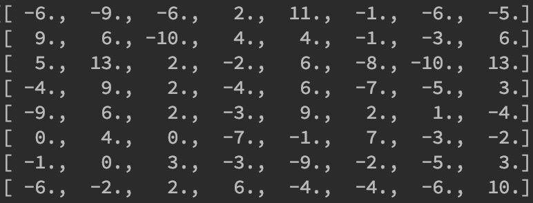

某大作业要求写一个图像压缩/解压缩的软件，因此在此梳理一下过程。

> 大作业[写完了](https://github.com/asvrada/gray-scale-jpeg-compressor)

图像压缩有许多标准，其中属 JPEG 所提出的压缩标准最为流行，你所见到的以`jpeg, jpg, jpe`等后缀命名的图片，均是用此种方法压缩。注意 JPEG 是一种有损压缩方式，图片质量压缩后会有不可逆转的损失。

> 比较常见的无损压缩格式是PNG

# 压缩流程总览


可以看到流程分为以下几步 

1. 颜色空间转换 (color space transformation)  
2. **缩减像素采样 (chroma downsampling)**  
3. 分块 (Block splitting)  
4. 离散余弦变换 (Discrete Cosine Transform)
5. **对变换后的矩阵进行“量化” (Quantization)** 
5. 将2D矩阵转为1D数组，并使用常规方法无损压缩

上述步骤中，**加粗**的步骤为带来图像质量损失的地方。

## 1. 颜色空间转换

我们都知道，计算机显示的图像一般是由RGB三色表示，简单明了。但是为了提升压缩率，我们在压缩前，事先将RGB颜色转换到YCbCr颜色空间。



RGB 转换到 Y Cb Cr 空间后，Y代表luma（亮度），Cb Cr分表代表两种色彩的浓度。由于相比色彩浓度，人眼对亮度的变化更为敏感，我们可以对Cb Cr空间的颜色信息进行适当的丢弃，提高压缩率。

## 2. 缩减像素采样

经过上述步骤，现在有三种颜色通道：Y Cb Cr。这一步只对 Cb Cr 通道分别进行。通过舍弃部分颜色浓度信息，提高压缩率。

常见选项为4:2:0，经过这一步后原来需要8个数字表示的信息，现在只需要2个，直接抛弃了75%的Cb Cr信息。



## 3. 分块

这一步很简单，将图片的每一个颜色通道分别分割成大小统一的矩阵，方便后续步骤的处理。常见矩阵大小为8x8或者16x16。将较大的图片分割为较小的区块是为了使DCT所花的时间不至于太长。

大部分图片的长宽并不是8或者16的整数倍，无法被完整的分块。对于分块后不足8x8的部分，通常是用0填满。

## 4.DCT

最神奇的一步来了。通过对上述每一个矩阵进行离散余弦变换，我们将数据转换到了频域。这一步是可逆的。

一般在DCT变换前会对矩阵做一个 element-wise 的减法，即每个元素减去128。这样将矩阵里每个元素的范围从 [0, 255] 变到 [-128, 127]。

略去繁琐的数学定义，DCT具体代码实现[如下](https://blog.csdn.net/qq_20613513/article/details/78744101)：意外的还挺简单的，不得不感叹数学的威力真是太强大了。

```python
def get_dct_matrix(N):
    D = np.zeros((N, N))
    for i in range(N):
        for j in range(N):
            if i == 0:
                tmp = math.sqrt(1 / N)
            else:
                tmp = math.sqrt(2 / N)

            D[i][j] = tmp * math.cos(math.pi * (2 * j + 1) * i / (2 * N))

    return D


def DCT(block):
    D = get_dct_matrix(block.shape[0])

    return np.matmul(np.matmul(D, block), D.transpose())


def iDCT(block):
    D = get_dct_matrix(block.shape[0])

    return np.matmul(np.matmul(D.transpose(), block), D)
```

DCT 变换后，虽然矩阵大小不变，但每个元素的意义已经不一样了。现在最左上角，也就是第一个元素，被称为 DC 系数，DC即Direct Current，直流。其余63个元素被称为 AC 系数，AC即Alternating Current，交流。具体含义与信号处理啥的有关，由于我不是很了解，目前无法给出更详细的解释。

据我所知，AC 系数 所保留的信息不是那么重要，因此可以在这方面进行适当的舍弃，这就是下一步要做的事。

## 5. 量化

这一步会使用到一个标准里已经定义好的量化矩阵，大小为8x8或者16x16。然后用DCT变换后的矩阵除以（element-wise）量化矩阵，并将商取为最接近的整数。由于商本是小数，经过求整后带来了精度的损失。这一步是不可逆的，解压时无法恢复到压缩前的精度。

量化后的矩阵会有大量连续的重复数字，方便下一步的无损压缩。


下面举一个例子，来展示实际应用中DCT加上量化的作用：


可以看到量化后，大量的元素现在变成了0，极大的压缩了原本的信息。

再来看看压缩后恢复的数据是什么样的，通过做上述步骤的拟变换，我们得到了：



一堆数字而已，看不出来什么，让我们观察一下转换前后数据的差值：



可以发现，转换前后误差最大也不过6%。

## 6. 无损压缩

接下来的步骤专注于如何最大化的无损压缩上述步骤产生的数据，以块为单位。

### 1. zigzag

这一步将2D矩阵通过如下图所示的Z字形扫描转换为1D数组。由于DCT+量化后，高频部分（即矩阵右下部分）的数值通常比较相似，或者干脆是大片的0，因此经过zigzag转换能将这一片数值相近的数字集中起来，方便下一步的压缩。


*Zigzag ordering*

### 2. 编码 DC/AC 系数

上文提到矩阵的第一个数值为DC系数，剩下的63个数值为AC系数。这两种系数会被分别编码。

#### DC

由于DC通常较大，因此每个块的DC单独拿出来进行差分编码 (differential encoding) 。

编码
$$Diff_i = DC_i - DC_{i-1}$$

解码
$$DC_i = Diff_i + DC_{i-1}$$


> 比如某4个块的4个DC系数为 200 201 202 203，他们将被表示成 200 1 1 1  
> 处理后的数字代表**压缩前**的当前数值与上一个数值的差值。

#### AC

AC系数数值普遍较小且多为0，因此采用类似run-length encoding的方法编码。

在进行上述步骤的同时，还要将数字进行哈夫曼编码进一步压缩储存空间。由于过于繁琐。。。我懒得解释了。。。。

---

最终使用哈夫曼编码系数之后，我们就得到了一串二进制数据，将这串数据附上合适的头部（块大小，量化表质量，图片大小等等）输出到文件即可。详细过程还请参考文章开头的项目链接。

---

哎，看[维基](https://en.wikipedia.org/wiki/JPEG)去吧，反正都是从上面抄的，我又是复读机了。