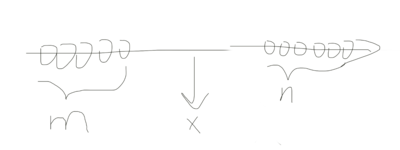
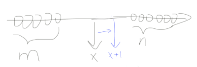
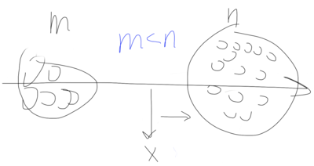
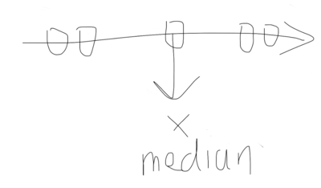

So while LeetCoding, I encountered problems like [296. Best Meeting Point](https://leetcode.com/problems/best-meeting-point/) where you use the fact that median gives you the shortest sum of distance from other nodes to it. And I am going to show your why, without boring math equations.

## Graph time

Suppose we have a 1D axis, and a bunch of points on it: (Sorry about the M$ Paint quality)

We randomly pick a point `x` on this axis to see if this is the best point with the minimal sum of distance to other points. And lets say there are `m` points to the left of `x`, and `n` points to the right of `x`.

## Let's try to minimize the sum

What would happen to the sum of distance if we move `x` to the right by 1 unit?

Well, since we are 1 unit further away from all of the `m` points on the left, the sum increase by `m`. And since we are 1 unit closer to all of the `n` points on the right, the sum also decrease by `n`. In other words: `new_sum = old_sum + m - n`.

Apparently, if there are more points on the right than these on the left, we should keep moving to the right to minimize the sum.

## And we've reached median

But when do we stop moving? Thats where `m == n`, i.e, there are equal number of points on either left or right. Because `m - n == 0` and we can't decrease the sum any further. And this point, is the median (because thats the definition of median: _The median is the value separating the higher half from the lower half of a data sample_)