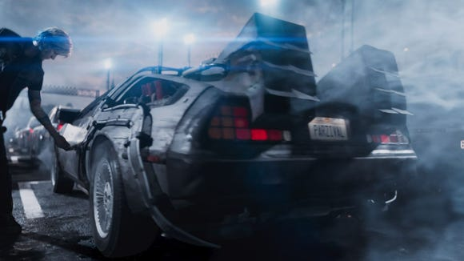
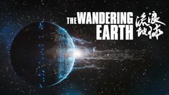

在我心中，头号玩家是一部完美的电影。即使在票房与口碑上，头号玩家都算不上成功的电影。

高达1亿7千万美金的预算，却只有不到6亿美元的全球票房；IMDB评分7.5，Metascore 64，烂番茄77%新鲜度。从数据上来看，这绝对算不上一个失败的电影。由于电影重点渲染了美国80年代的文化背景，而这段背景对全世界来说必然是小众话题。特别是电影中大量出现的那个时代独特的致敬，对于路人观众来说可能get不到不少场景（包括我）。并且除了对文化大量的致敬，电影也没有在其他方面特别出彩的地方，因此即使花了大力气也只取得这样中规中矩的成就，我觉得可以理解。

这部电影在我心中有着很高的地位。但是说起来也很荒谬，我喜欢这部电影，只因为它里面很小的一个点：主角的座驾是《回到未来》里的时间机器 DeLorean，而《回到未来》系列则是我最喜欢的电影。如果导演决定随便换一辆那个年代其他什么流行文化的座驾，我可能就没有现在这种对这个电影的兴趣了。你看，人就是这么不理性，只要是自己的喜欢的，全盘接受，不讲道理。

> 电影中主角的座驾，《回到未来》中出现的DeLorean

但如果这电影里只有这一辆 DeLorean，我肯定也不会喜欢。我觉得这个电影最成功的地方在于，他将那个年代的文化又全部而仔细的通过现代技术“复活”了。小时候看完《回到未来》三部曲后，我真的很希望继续跟随主角们进行冒险，然而现实总是无情的。如今距离电影上映已过去30多年，连电影中构想的30年后的未来2015年，也早已成了历史。未来不会再有《回到未来》的续作了，而那段记忆也像那时尚不成熟的电影技术一样，渐渐过时。唯一能够继续这段冒险的地方，只有网络上大神们的二次创作了。

《头号玩家》的创作者不计代价的将自己喜欢的元素通过最先进手段再现，以重新体验那时初次见面的感觉。凭借最先进的电影技术，DeLorean得以以高清的细节重返大荧幕，好比沉寂多年的大神再次出山，惊叹世人。对于喜欢这些元素的人来说，即使只能多看几秒，也是值得的。具体的荧幕影像，满足了他们对这些元素的无尽想象。从此虚无缥缈的想象有了看得见的形态，就像种子有了发芽的土壤，让这些元素焕发出新的生命力。

这也是我为什么喜欢科幻电影的原因。电影通过非常现实的画面将一个个仅存在于文字之间的概念转变成“真正”存在的物体，极大的满足观众的感官。毕竟，视频有时候比枯燥的文字更直观，更具冲击力。比如说最近最强的中国科幻片《流浪地球》，就通过大荧幕将刘慈欣笔下模糊的高概念转化为了实实在在的场景。在同名小说中，推动地球前进的行星发动机高度甚至超过世界最高山喜马拉雅山，发动机喷出的火焰直上云霄，”有如上帝的喷灯“。但是面对这些模糊的文字，读者仍然很难现象在现实中这些东西会是什么样子：比喜马拉雅山还高？那感觉是挺高的，可是到底有多高？文字无法表现出那种冲击。

电影却可以。在电影《流浪地球》中有一幕，镜头一路从一个行星发动机的底部一路移动到地球大气层之外。即使已上升至高空，却仍能看到发动机巨大的基座，同时地面上大型运货车却已成了星星点点；再往外拉远，即使整个地球已经尽收眼底，却仍能清晰的看到最大的行星发动机发出的火焰。其尺寸之大，无需再用枯燥的数字去描写。

希望有生之年能看到《三体》系列的影视化。